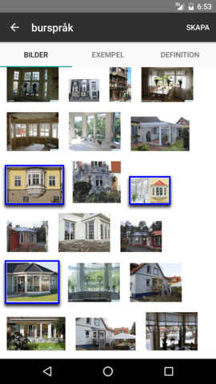
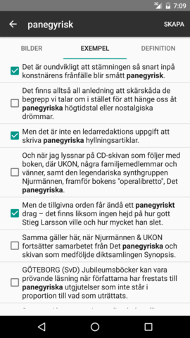

# Bildkortsappen

 

Bildkortsappen is an Android app to create flashcards for language learning.
Given a word, it presents an interface where the user can pick images which
correspond to that word (currently from Google Image Search) or real-world
example sentences which use that word (from a concordance).

The flashcards are created directly in
[AnkiDroid](https://play.google.com/store/apps/details?id=com.ichi2.anki) and
use Javascript to display a random subset of the chosen images and example
sentences on the front side, and a user-specified reverse side.

While the image search should work for any language, only Swedish is supported
for the interface and the example sentences.  The examples are retrieved from
[Språkbanken](https://spraakbanken.gu.se/swe)'s
[Korp](https://spraakbanken.gu.se/korp/) service using [their
API](https://spraakbanken.gu.se/swe/forskning/infrastruktur/korp/ws).

Words can be added manually or via sharing from any Android app.  Words shared
to Bildkortsappen from the [Ordboken Swedish
dictionary](https://play.google.com/store/apps/details?id=in.rab.ordboken) will
automatically have their HTML-formatted definition used for the reverse side of
the created flashcards.
